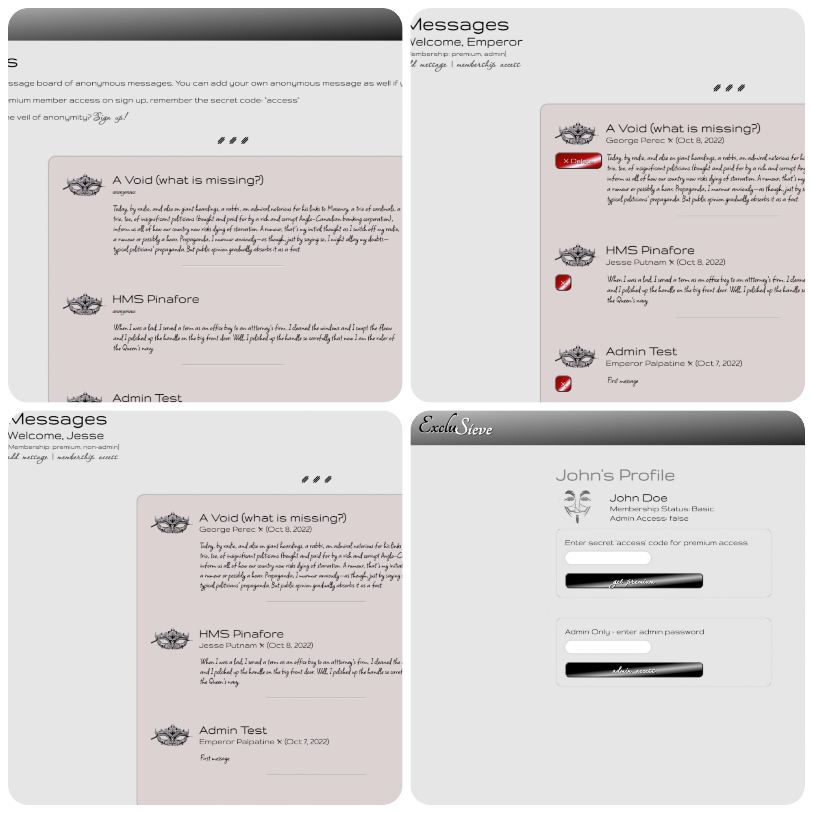

# Members Only

Anonymous posting app

## Table of contents

- [Overview](#overview)
  - [The challenge](#the-challenge)
  - [Screenshot](#screenshot)
  - [Links](#links)
- [My process](#my-process)
  - [Built with](#built-with)
  - [What I learned](#what-i-learned)
  - [Continued development](#continued-development)
  - [Useful resources](#useful-resources)
- [Author](#author)
- [Acknowledgments](#acknowledgments)

## Overview

### The challenge

Users should be able to:

- Sign in securely
- See messages from other anonymous users
- Create messages with title, timestamp, and text
- Sign up for exclusive membership access
- See usernames and timestamp from messages IF exclusive membership access granted
- IF admin access, see delete button on messages and delete messages

Programming focus:

- Database should kep track of who created each message
- Secure sign in with PassportJS

### Screenshot

### Links

- Live Site URL: [ExcluSieve](https://exclusieve.herokuapp.com/)

## My process

### Built with

- Flexbox
- [JavaScript](https://www.javascript.com/) - Frontend scripting language
- [Node.js](https://nodejs.dev/en/) - Backend JavaScript runtime environment
- [Express](https://expressjs.com/) - Web framework for Node.js
- [MongoDB](https://www.mongodb.com/) - NoSQL cloud database
- [Mongoose](https://mongoosejs.com/) - MongoDB object modeling for Node.js
- [PassportJS](https://www.passportjs.org/) - Authentication middleware

### What I learned

- How to set up authentication and sessions with Passport.
- Double up on security -- just becuase the user cannot click to get to a POST or GET call, does not mean they cannot access it. Keep hidden in PUG with checks against `currentUser`, but also use checks against `currentUser` in the function calls themselves, creating new errors to return if accessed without proper credentials.
- The order of operations when setting up passport sessions is very important.

## Author

- Website - [Jesse Putnam](https://jessejputnam.com)
